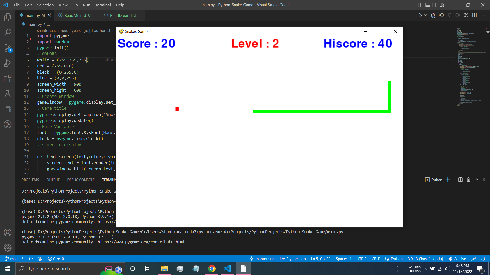
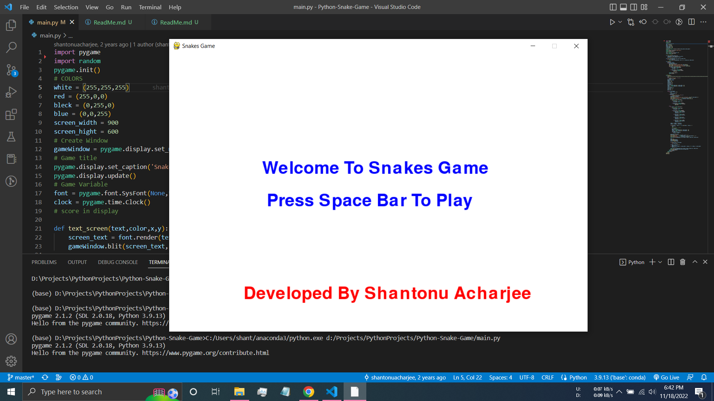
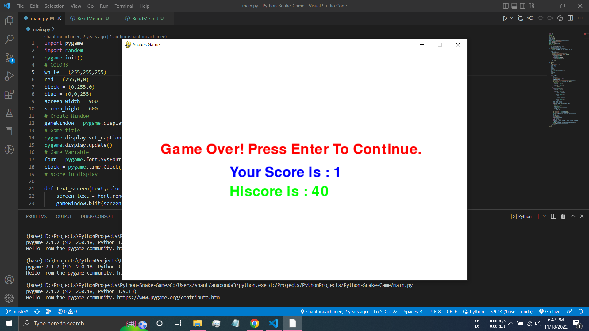

<h1 align = "center">Python Snake Game</h1>

For Windows `pip install pygame`

For Linux `sudo pip3 install pygame`

  
  
  

# Connect with me

- **Author:-** Shantonu Acharjee
- **Phone     :-** +880 1789333514
- **Email     :-** ShantonuAcharjee@gmail.com
- **Website   :-** https://shantonuacharjee.blogspot.com
- **Linkedin  :-** https://linkedin.com/in/shantonu-acharjee
- **Kaggle    :-** https://kaggle.com/shantonuacharjee1
- **Facebook  :-** https://fb.com/shantonuacharjeeshanto
- **Instagram :-** https://instagram.com/shantonu_acharjee
- **YouTube   :-** https://www.youtube.com/c/it’smeshantonu

  

Copyright © 2022 Shantonu Acharjee

